# New York Times Bestseller list analysis

## Project Overview
 
This project explores historical trends in New York Times bestsellers list between 2010 and 2025, using data collected from the NYT API and additional metadata sources.

This project focuses on:
- Author and publisher dominance
- Ranking and longevity in the list
- Genre trends
- Title word patterns
- Ranking trajectories over time

## Research Questions

- Which authors dominated the #1 spot?
- Which publishers had the most successful titles?
- How did TV adaptations affect book rankings?
- Which words become more common in bestseller titles over time?
- Which genres showed the strongest long-term presence?

## Dataset
The data was collected from:
- New York Times Books API

The data set includes:
- Weekly bestseller rankings
- Titles
- Authors
- Publishers
- ISBNs
- Ranking history (rank last week)
- Dates

The dataset covers the period from 2010 to 2025.

## Technologies used
- Python
  - Pandas
  - SQLite3
  - Matplotlib
- Google Colab
- Tableau

## Environment variables
Create a `.env` file and add your NYT API key:
```env
NYT_API_KEY=your_api_key_here
```

## Getting the data
To obtain the book data, we used the New York Times API, and the `requests` library.

```Python
while date <= end:
	params = {
		"published_date": date.strftime("%Y-%m-%d"),
		"api-key": api_key
	}
	r = requests.get(url, params=params)
```

The API responses were parsed and transformed into structured rows, and saved into a csv file for further analysis.

## Data Cleaning & Processing
First, we transformed both author and publisher names into upper case letters.

### Cleaning author names
Having the authors names into upper case, we normalized the authors names, so that there were no special characters and duplicates because of it, such as:

| author         | book |
|----------------|------|
| ROBERTO BOLAÑO | 2666 |
| ROBERTO BOLANO | 2666 |

Obtaining, in this example:

| author         | book |
|----------------|------|
| ROBERTO BOLANO | 2666 |

Other problem the data had was co-authored books, especially if we wanted to know how many times an author appeared on the list, no matter if their books were written alone or with other authors.

To do so, first, we replaced all instances where the authors name had `AND`, `&`, `WITH`, `,`, or `;` with `|` so later we could split both authors, so instead of having:

| author                            | book              |
|-----------------------------------|-------------------|
| ROBERT JORDAN & BRANDON SANDERSON | A MEMORY OF LIGHT |

We obtain after splitting them:

| author            | book              |
|-------------------|-------------------|
| ROBERT JORDAN     | A MEMORY OF LIGHT |
| BRANDON SANDERSON | A MEMORY OF LIGHT |

But after doing so, there was yet another problem: there were books with text such as `INTRODUCTION BY`, `WITH WORDS BY`, `ILLUSTRATED BY`, `NOVELIZATION BY`, `WRITTEN BY`, etc. So, gathering in a list all such texts producing noise in the author column, we removed them.

## Interactive Dashboard
(Coming soon)

## Future Improvements
- Expand genre classification
- Add sentiment analysis
- Develop predictive ranking models

## Repository Structure

/scripts
    Data collection and preprocessing scripts

/notebooks
    Exploratory data analysis and visualizations

/sql
    SQL queries used for analysis

/images
    Visualizations and dashboard screenshots

/tableau
    Tableau dashboard files

## Images
### Top Authors
We got the authors that had the most number of books in the period of 2010-2025 in the number 1 rank in the Fiction categories (Hardcover, Paperback Trade, Paperback Mass-Market, E-Book, and Audio), and got the following graphs. The Top authors in physical books:
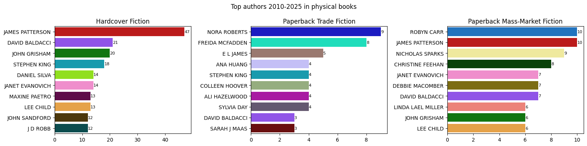
The top authors for physical books are no surprise to anyone that have entered a bookstore: James Patterson, David Baldacci, Stephen King, Nora Roberts... They are all authors that have a lot of books out there, in many cases having entire shelves for their books. What is a surprise, though, is that the number of books during this period of time in the Hardcover list does not equate in the paperback lists: we don't see those Patterson's 47 titles on any of the paperbacks. This could be because their books are published first in hardcover, and the paperbacks we see on the list are his backlist and are sold regardless if they are new books republished as paperbacks.

And the top authors in digital books:
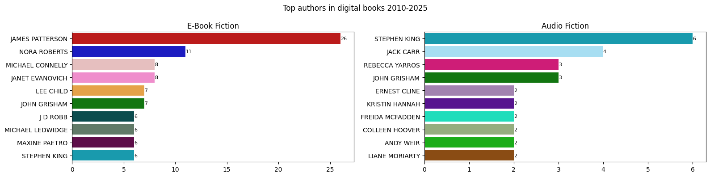
Another thing of note we can see, is that on the paperback lists, or in the digital editions, we see more authors like Ana Huang, Colleen Hoover, Ali Hazelwood, Sarah J. Maas, Ernest Cline, Rebecca Yarros, Andy Weir, that in some cases "compete" with the same number of books on the list as the big-name authors—with their success, or "boom" achieved through people talking about the books online through YouTube, TikTok, Instagram, among other social media platforms.

### Dominance of #1 spot of the list
Other important question we wanted to answer was how long these top authors remained on the number 1 spot for all the years between 2010-2025.
#### Physical Books
Looking at the number of weeks for each year that these top authors had a book at rank #1 of the list across the categories on the same period of time, we have:  
##### Hardcover Fiction
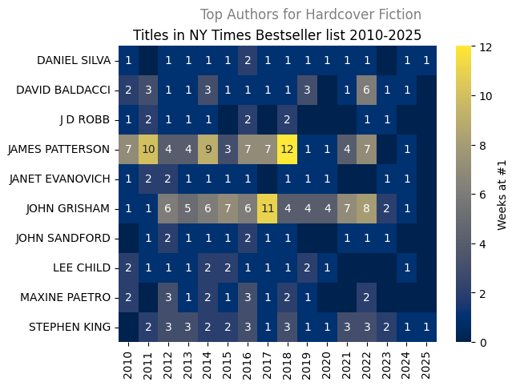

##### Paperback Trade Fiction
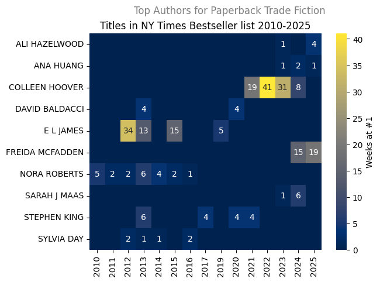

##### Paperback Mass-Market Fiction
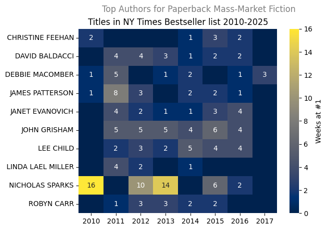

#### Digital Books
##### E-Books
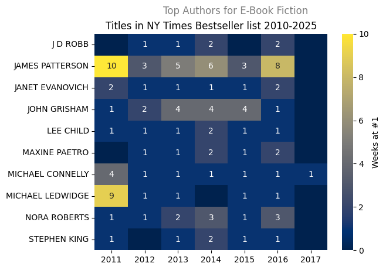

##### Audio
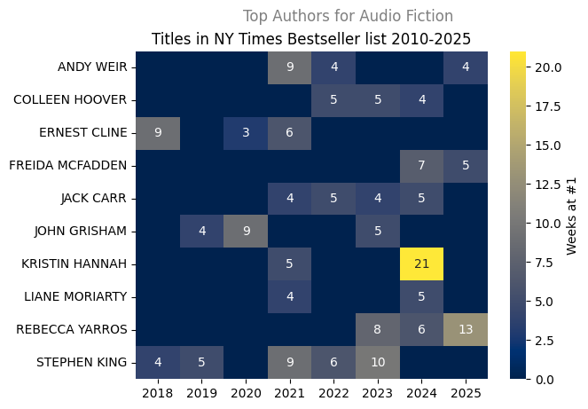

### Top Imprints
Similar to the "Top Authors" situation, we wanted to know which Publishing Groups had the most books on number 1 spot on the list in that period of time, obtaining the following for the physical books:
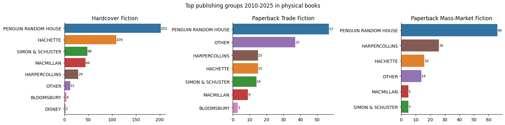
And the digital books:
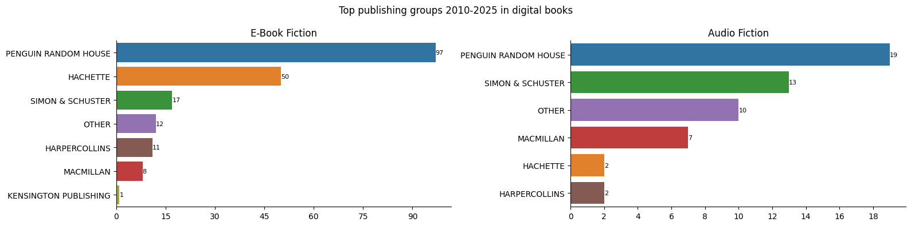

#### Top Imprints for each of the "Big Five" Publishing Groups
We also wanted to know what publisher/imprints had the most books on the number 1 spot for each of the "Big 5" publishing groups (Penguin Random House, Hachette, Simon & Schuster, Macmillan, and HarperCollins).

Obtaining the following for Penguin Random House:
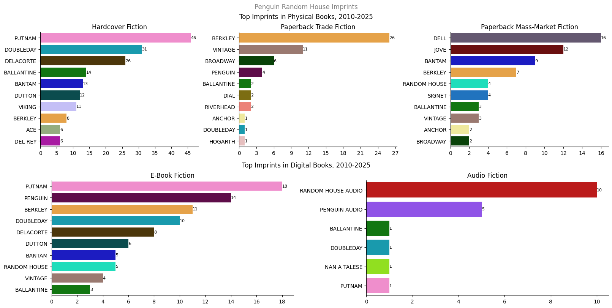

Hachette:
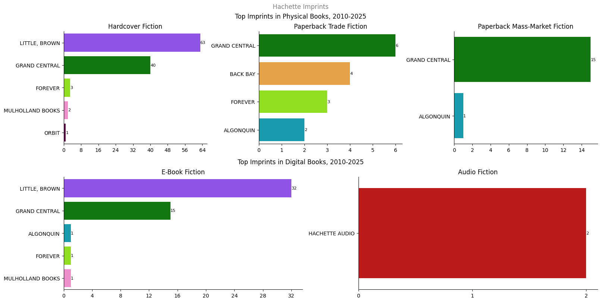

Simon & Schuster:
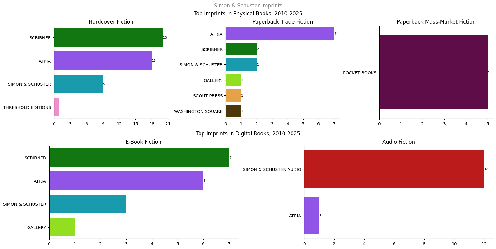

Macmillan:
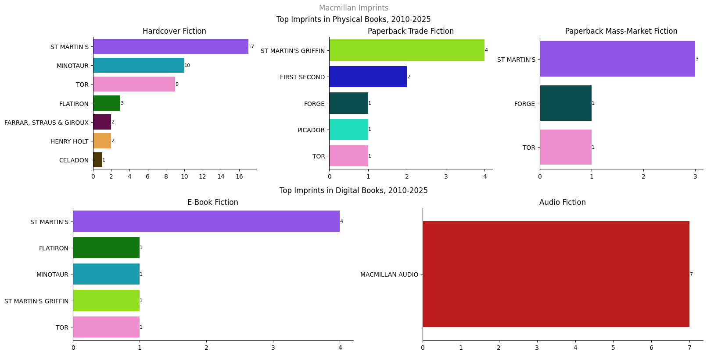

HarperCollins:
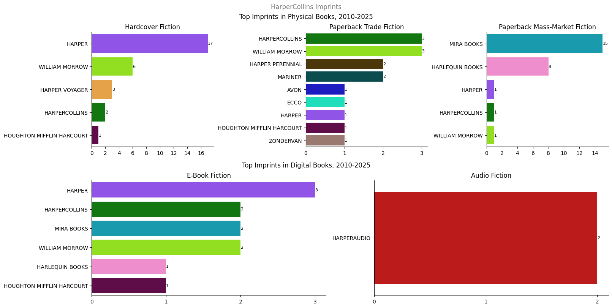

Finally, looking at all the imprints in general, including those not part of the "Big 5" we got:
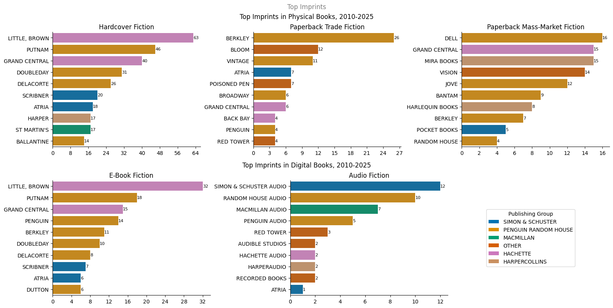

### The Impact the *Game of Thrones* TV adaptation had over the NYT Bestseller rankings of the books
We wanted to see if the rankings went up during the airing of the show, or when the trailers/teaser trailers were dropped, to determine if there was any type of impact of the show with the books ranking on the list.

Here is an example of the trajectory the book *A Feast for Crows* (book #4 of the *A Song of Ice and Fire* series which the show was based on) on the "Paperback Mass-Market Fiction" list:
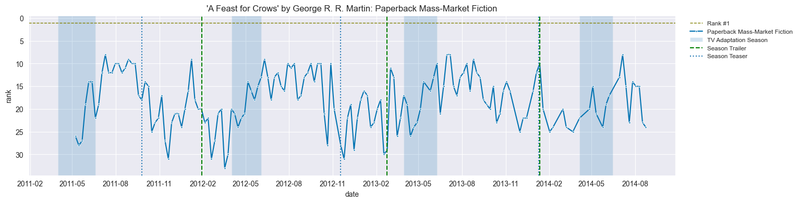
We can see how during a season being aired the book rankings go up, as well as some spikes in the rankings when a trailer or teaser trailer for a new season is published.

We also plotted the trajectory of the book rankings within the seasons with vertical lines representing each episode, to see the spikes in the ranking as well as the episode aired that may have caused it. For example, the print editions for *A Game of Thrones* during the first season of the show:
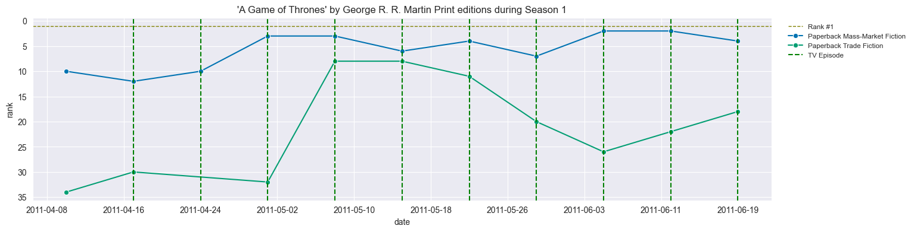
In this plot, we can see the rankings of the book on both the Mass-Market and the Trade Paperback ranking list. The fact that the Mass-Market rankings is higher than the Trade may be because Mass-Market paperback are cheaper and therefore more likely that people will give it a chance than with the trade, which is more expensive. But then, during episode 4 week, Trade's ranking goes up from ~rank 30 to ~10, regardless if the format is not the cheaper option, almost getting the same rank the book has in the other format.
